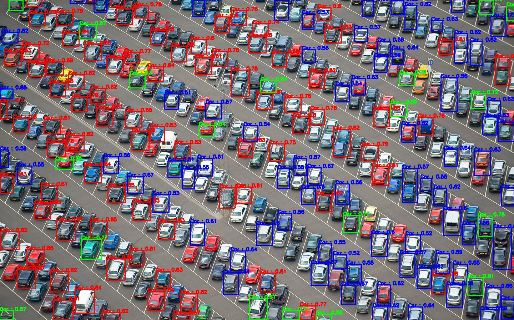

### Drone Reputation Simulator

#### Overview

In the realm of artificial intelligence (AI) systems, the measure of trust encapsulated within the concept of reputation holds paramount significance in fostering efficient connections. This project centers around the intricate modification of reputation values assigned to individual drones within a meticulously controlled simulation environment. Serving as intelligent agents with predefined tasks, these drones operate within a reputation-based framework, where the project’s core objective is to unravel the consequences ensuing from alterations in their reputation values.

#### Project Objectives

The primary goal of this project is to explore the nuanced dynamics of reputation, recognizing its pivotal role in shaping the behavior and interactions of intelligent agents. Specifically, the project aims to:

- Investigate the impact of reputation value alterations on the overall process.
- Test the master control system’s outcomes in response to changes in reputation values.
- Discern how changes in reputation values influence not only individual drone performance but also the collective behavior of the drone fleet.

#### Key Features

1. **Reputation Modification:** The project provides a platform to systematically modify reputation values assigned to individual drones.

2. **Simulation Environment:** A meticulously controlled simulation environment for drones to operate within, mimicking real-world scenarios.

3. **Intelligent Agents:** Drones are designed as intelligent agents with predefined tasks, and their behavior is influenced by reputation values.

4. **Outcome Analysis:** Comprehensive tools for analyzing and visualizing the outcomes of reputation value alterations on individual and collective drone behavior.

#### Image

#### Learn More

To delve deeper into the project and its theoretical foundations, refer to the [Reputation_Multi_Agent_Systems.pdf](Reputation_Multi_Agent_Systems.pdf) document.

#### Contribution Guidelines

Contributions to the project are welcome! If you would like to contribute, please follow the guidelines outlined in [CONTRIBUTING.md](CONTRIBUTING.md).

#### License

This project is licensed under the [MIT License](LICENSE).

#### Contact

For any inquiries or feedback, please contact [Diogo Rosário](mailto:se.dev.rosario@gmail.com).

---

*Note: The above README.md template provides a basic structure. Be sure to customize it according to the specific details and requirements of your project.*
